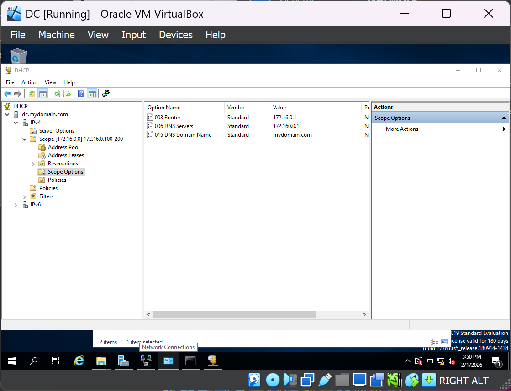
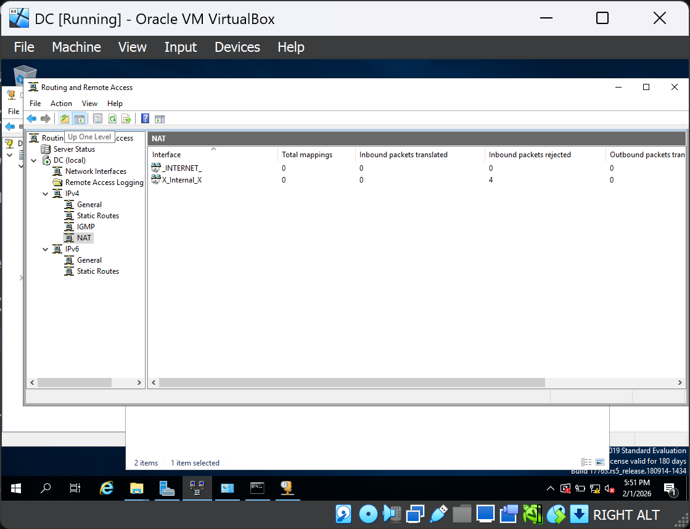

# 📂 Automated Active Directory Environment & Network Troubleshooting

**Goal:** Deploy a Windows Server domain controller to manage users and security groups at scale.
**Skills:** Active Directory (AD DS), DNS/DHCP configuration, PowerShell Automation, and Layer 7 Troubleshooting.
**Key Achievement:** Successfully automated the creation of 1,000 user accounts via PowerShell and resolved critical DNS/Connectivity hurdles to join a Windows 10 client to the domain.

#### 🛠️ Real-World Troubleshooting (The Challenges)
In this lab, I encountered and resolved several complex issues that simulated high-pressure helpdesk escalations:
* **DNS Resolution & SRV Records:** Diagnosed a "Domain Not Found" error. I identified that while a Hosts file allows a "ping," it lacks the SRV records required for Active Directory. I resolved this by correctly configuring the Client's DNS to point to the Server IP.
* **Network Isolation:** Resolved connectivity "blackouts" by matching VirtualBox Internal Network names and disabling conflicting NAT adapters to ensure a clean path to the Domain Controller.
* **Kerberos Authentication:** Fixed domain join failures by performing a manual time-sync between the Client and Server, ensuring the system clocks were within the required security window.

#### 📸 Lab Evidence: Full Infrastructure Walkthrough

**A. Virtual Networking & Topology**
*Configuring dual NICs on the Domain Controller to bridge the private internal network with the NAT internet gateway.*

**B. PowerShell Automation**
*Using a PowerShell script to parse a .csv and instantly build out 1,000 users and Organizational Units (OUs).*

**C. Network Services (DHCP & NAT)**
*Configuring the DHCP scope to automate IP management and setting up Routing/Remote Access (RRAS) for internet passthrough.*

**D. Connectivity & Domain Join Verification**
*Verifying end-to-end connectivity via ICMP ping and confirming successful domain authentication with the `whoami` command.*

---

## 🧠 Skills Learnt
* **Enterprise Identity Management:** Gained hands-on experience in managing the lifecycle of users, groups, and Organizational Units (OUs) within a Windows Domain environment.
* **Network Protocol Mastery:** Developed a deep understanding of how **DNS (SRV records)** and **DHCP** interact to provide service discovery and automated addressing in a corporate network.
* **Automation Efficiency:** Learned to leverage **PowerShell** to eliminate repetitive administrative tasks, such as bulk user creation, reducing human
